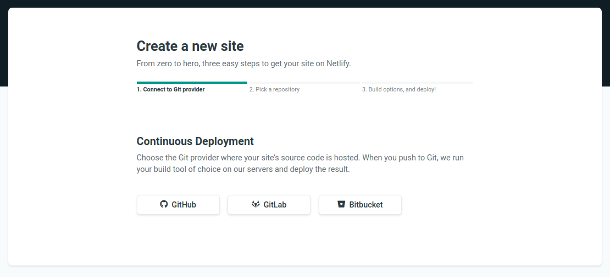
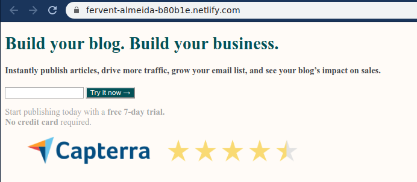

# Ej. 03 - Agregando el home de Matcha
## Objetivos
1. Agregar el primer contenido a tu proyecto usando HTML.
2. Aprender como usar las etiquetas de HTML.

---
<br/>

## Requisitos
- Tener Sublime Text 3 instalado.
- Conocer estructura básica de las etiquetas HTML.

---
<br/>

## Instrucciones

Siguiendo el diseño del sitio original de [`Matcha`](https://bedu-fef.netlify.app/),
podemos ver que lo primero que aparece son textos de diferentes tamaños y
colores además de un formulario y una imagen.

Para agregar el texto principal podríamos usar un párrafo (etiqueta `<p></p>`).
Sin embargo, este texto quiere mostrar lo que nos permite realizar el servicio
de `Matcha` y darle un mayor énfasis y diferenciarlo de los demás textos.

Para lograr este efecto _semántico_ en nuestro sitio web, podemos usar los
_headings_ (encabezados). Estos nos ayudan a dar un énfasis jerárquico de
acuerdo al número que nosotros utilicemos, siendo posible usar del 1 al 6,
con 1 como el de mayor peso jerárquico y 6 el menor.

En este caso, queremos el texto inicial es el de mayor peso jerárquico por lo
que usaremos el heading de peso 1, y esto lo indicamos haciendo uso de la
etiqueta `<h1></h1>`.

Aplicalo a nuestro código existente:

```html
<!DOCTYPE html>
<html>
  <head>
    <!-- Aquí va información importante pero no visible dentro del navegador -->
    <title>Matcha</title>
  </head>
  <body>
    <!-- Esto es lo que se verá en el navegador web -->
    <h1>Build your blog. Build your business.</h1>
  </body>
</html>
```

Abre este archivo en tu navegador y mira el resultado. ¡Tu primera página web!
Claro, solo es un texto, pero ¡es un gran primer paso!

<br/>

# Reto 01 - Etiquetas con diferente peso jerárquico

## Objetivos
1. Agregar textos con diferentes niveles de jeraquía.

<br/>

## Desarrollo

La principal diferencia para un elemento `<h1>` es el peso semántico que le queremos dar al texto. Si
el texto que queremos mostrar no es necesariamente diferente a cualquier otro
texto que tengamos en la web, probablemente un párrafo `<p>` funcione bien y luego
podríamos cambiar su apariencia para darle los efectos visuales deseados. Sin
embargo, si deseamos resaltar dicho texto sobre otros existentes, podemos usar
un encabezado para darle una jerarquía y diferenciarlo de los demás.

Vamos a insertar el texto que se encuentra debajo de la frase "Construye tu blog...". ¡Adelante!

<br/>

<details><summary>Posible solución</summary>

Insertemos los elementos de la página de Matcha que imitaremos en nuestro proceso de aprender a elaborar una página web moderna.

```html
  <head>
    <!-- Aquí va información importante pero no visible dentro del navegador -->
    <title>Matcha</title>
  </head>
  <body>
    <h1>Construye tu Blog. Construye tu negocio.</h1>
    <p>Instantly publish articles, drive more traffic, grow your email list, and see your blog's
      impact on sales</p>
  </body>
```

</details>

<br/>

# Reto 02 - Texto promocional

## Objetivos
1. Modificar formato del parrafo agregado en el reto-01.
2. Crear un texto con estilos, usando etiquetas específicas para ello.

<br/>

¿Cómo harías para agregar el texto promocional, que aparece abajo del elemento para insertar tu correo electrónico? ¿Te has dado cuenta que dentro
del mismo texto hay algunas palabras que tienen un mayor énfasis (formato en
_negrita_)? ¿Cómo harías para cambiar el formato de solo esas palabras?

Probablemente ya habrás pensado que existe una etiqueta para eso, no te
intimides y pregúntale a San Google (se volverá en uno de tus mejores amigos).

<br/>

<details><summary>Posible solución</summary>
<p>

```html
  <p>
    Start publishing today with a <strong>free 7-day trial.</strong>
  </p>
  <p>
    <strong>No credit card</strong> required.
  </p>
```

</p>
</details>

<br/>

# Ej. 04 - Agregando un formulario

## Objetivos
1. Aprender a usar elementos interactivos de un formulario de HTML: `<input>`

---
<br/>

## Requisitos
- Tener Sublime Text 3 instalado.

---
<br/>

## Instrucciones

Los formularios en HTML hacen uso de etiquetas particulares para denotar el tipo
de _control_ (caja de texto, botones, etc) que se va a usar en el formulario.

La mayoría de cajas de texto se definen con la etiqueta `<input />` y su
comportamiento por defecto depende del uso del valor de un atributo, llamado
`type`. Esta etiqueta no lleva contenido dentro de la misma, por lo que la
manera de cerrar la etiqueta es automática usando `/>` en vez de `</input>`.

El `input` más común usado en los formularios es:

```html
<input type="text" />
```

Usando este tipo de _input_, la web mostrará una caja de texto que permitirá
ingresar cualquier tipo de texto (números, letras, caracteres especiales, etc),
mientras que usando otros tipos podemos agregar algunas validaciones por defecto
que tenga el navegador. En este formulario, tenemos necesitamos obtener un
correo electrónico del usuario. Para este caso, usaremos el tipo `email`.

```html
<input type="email" />
```

Para terminar el formulario necesitamos agregar un botón, y eso lo logramos a
través de la etiqueta `<button></button>`. Debido a que el texto del botón se
pone entre las etiquetas, el cerrado de la etiqueta no es automático. Además del
texto es importante indicar el tipo de acción que realizará cuando se le de
click al botón. En este caso queremos que el formulario envíe el correo que el
usuario ingresa y por ende el tipo de botón a usar es `submit`.

Un detalle importante es que los controles de formulario deben estar
dentro de una etiqueta `<form></form>`. Nuestro HTML del formulario quedaría así:

```html
<body>
  <!-- Aquí va el código anterior-->
  <form>
    <input type="email" />
    <button type="submit">
      Try it now &rarr;
    </button>
  </form>
</body>
```

Este formulario por si solo no hará ninguna acción, por el momento solo
dejaremos que esté visible, la funcionalidad la dejaremos para después.

<br/>

# Reto 03 - Agregando una imagen

## Objetivos
1. Insertar imágenes en nuestro proyecto.
## Desarrollo

Es tu turno de agregar la última parte de la estructura que tenemos pensado para esta sesión: la imagen. Esta la puedes obtener desde este [link](https://ignos.blog/wp-content/uploads/2021/04/capterra.png). También puedes comentar el contenido del formulario de práctica que hicimos en la actividad anterior.

<br/>

> TIP: No dudes en googlear, preguntar al experto y tus compañeros y probar todo lo que te
> imagines. Recuerda que tu máquina no se malogrará si pones una etiqueta que no existe o
> que está mal escrita.

<br/>

<details><summary>Posible solución</summary>
<p>

```html
<body>
  <!-- Aqui va el html que hemos escrito hasta ahora-->
  
</body>
```

</p>
</details>

<br/>

# Ej. 05 - Agregando color al texto principal

## Objetivos
1. Aprender a usar propiedades de CSS para definir estilos.

---
<br/>

## Requisitos
- Tener Sublime Text 3 instalado.

---
<br/>

## Instrucciones

La primera propiedad que veremos en CSS será la de `color`, y la usaremos para cambiar
el color de los textos que hemos agregado.

Los valores de los colores pueden ser expresados de diversas maneras, en este
caso usaremos el formato hexadecimal. El texto de la página original usa el
color `#025157`, y este color debemos aplicarlo al elemento `h1`. Como hay muchos elementos HTML dentro de la etiqueta `<body>`, nuestro CSS debe seleccionar el elemento correcto al que le aplicará los estilos que queremos. Para ello, CSS utiliza selectores,
que en nuestro caso será el de la etiqueta `<h1>`. En ese caso, nuestro CSS quedará así:

```html
<head>
  <style>
    h1 {
      color: #025157;
    }
  </style>
  <!-- aqui va el código que hemos escrito -->
</head>
```

Recarga tu navegador para que puedas ver los cambios reflejados. ¡Ahora ya tienes
tu texto con color!

<br/>

 # Reto 04 - Cambia los colores
## Objetivos
1. Usar propiedades de CSS para dar estilo a varios componentes de texto.
2. Aprender a usar CSS para centrar elementos en la página.

## Desarrollo

Los colores que van a aplicar son los siguientes:

- Texto que va debajo del título: `#46484c`
- Texto promocional: `#8b8b8bcc`
- Texto del botón: `#fff`

<br/>

Ahora te toca buscar en Google, ¿cómo puedes agregar una hoja de estilos a tu proyecto? ¿Qué propiedad usarías para cambiar el color de fondo? ¿Qué selector usarías para cambiar el color de fondo de toda la página?

- Color de fondo de la página: `#fffbf7`
- Color de fondo del botón: `#025157`

<br/>

<details><summary>Posible solución</summary>
<p>

Debes crear un archivo denominado <code>styles.css </code>, en la misma carpeta donde encuentras <code> index.html </code>. Recuerda usar <code>touch </code> para crear este archivo.

Al abrir el archivo con VSCode, observarás que está vacío. Vamos a llenarlo con algunas cosas, según los cambios de color y alineación del texto que necesitas:

```css
body {
    background-color: #fffbf7;
}

h1 {
    color: #46484c;
    text-align: center;
}

p {
    color: #8b8b8bcc;
    font-family: verdana;
    font-size: 20px;
}

button {
    color: #fff;
    background-color: #025157;
}
```
Ahora, debemos referenciar la hoja de estilos que está en <code> styles.css </code> en nuestro <code>index.html </code>, para que los estilos se apliquen. 

También debemos borrar la etiqueta <code> < style > </code> y su contenido, por lo que el contenido de <code> < head > </code> quedará así: 

```html
<head>
    <title>Matcha</title>
    <link rel="stylesheet" href="styles.css">
</head>
<body>
    <!-- aqui va el contenido html -->
</body>
```

¡Listo! Ahora has cambiado con éxito los colores de varios elementos en tu página web.

</p>
</details>

<br/>


# Ej. 06 - Subiendo el proyecto a Netlify

## Objetivo

Publicar tu página web en Netlify mediante su servicio gratuito.

---
<br/>

## Requisitos
- Tener cuenta en Netlify
- Tener un editor de código instalado

## Instrucciones

Lo primero que debemos hacer, es registrarnos en el sitio de [Netlify](https://www.netlify.com/).
Te recomendamos que utilices tu cuenta de GitHub como registro ya que en caso de
utilizar otro método, más adelante será necesario que se vincule de todas maneras.

Una vez dentro de la plataforma de Netlify con la sesión inciada, nos aparecerá
una sección llamada `Sites` mostrando una barra de búsqueda y un botón con el
texto `New site from Git`. Daremos clic a dicho botón:


Esta nos llevará a otra pantalla en la cual tendremos que seleccionar el
proveedor de proyectos basado en Git donde se encuentra nuestro repositorio.
En nuestro caso, seleccionaremos GitHub el cual estamos usando:



Una vez autorizado el acceso a nuestros repos de GitHub, nos mostrará la lista
de repositorios que tenemos en nuestra cuenta, seleccionar el del proyecto que
hemos trabajado durante la sesión de hoy. Luego nos mostrará una pantalla como
esta:


En este paso, no es necesario realizar ningún cambio ya que nuestro sitio
respeta las convenciones usadas por defecto y no usa ninguna herramienta de
optimización como veremos en futuras sesiones. Procedemos a dar clic en el botón
`Deploy site` y nos mostrará:


Aquí podrás ver que se ha generado una URL aleatoria, en la cual si le das clic,
podrás ver el resultado final:



Con esto, ya tienes tu sitio publicado en internet y un link que cualquiera
puede ver. Así que, ¡comparte con tus amigos y familiares lo que has logrado en
tu primera sesión!

> TIP: El nombre aleatorio que Netlify genera en el link es algo complejo de
> memorizar y no se ve muy amigable como para compartirlo en redes sociales,
> no te preocupes, este se puede configurar en la pantalla donde te avisó que
> tu sitio estaba listo, atrévete a experimentar y cambia el nombre del dominio
> para que se vea más cool y sea más fácil de recordar con quienes lo compartas.


 <br/>
